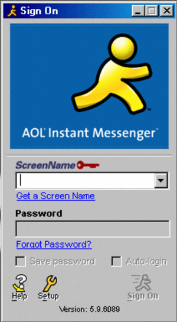

  

# 🖖 Hey dev! Welcome to my profile 

I'm a full-stack developer with a passion for building things and exploring new tech.

I've been working with technology since 2019, and over the years I've dabbled in everything from game development to web and app programming.

I have a bachelor's degree in computer science, and I'm currently doing a master's in machine learning.  
Right now, I'm writing my thesis on classifying and identifying breast cancer using **magnification-independent breast cancer analysis with Vision Transformers**.

I'm always curious and love learning new things, whether it's a new framework, algorithm, or game engine.

Speaking of games, I'm also really into game development. I currently use **Godot**, and some of my games are open source on my [GitHub page](https://github.com/brageaasen/Fuel-Fury), including one called *Fuel Fury*.

 
 
 

## 👨🏻‍💻 About me

 

- 🌎 I'm from Norway
- 👨🏻‍💻 Love programming and gaming
- 🧠 Love sharing knowledge
- 🌌 Passionate about the sky
- ✈️ Traveling is one of my favorite hobbies
- 📧 Reach me via brageaasen@hotmail.com

 
 
 
 
 
 

## 💻 Tech stack

<!-- Programming Languages -->

  
  
  
  
  
  
  
  

<!-- Machine Learning & Data -->

  
  

<!-- Web & App Development -->

  
  
  

<!-- Tools & Environments -->

  
  

<!-- Game Dev -->

  
  

---

 
  <i>Thanks for passing by</i>  
  <i>Feel free to connect with me</i>  
  <a href="https://www.linkedin.com/in/brage-aasen-b1054b224/">
  <code></code>
</a>

